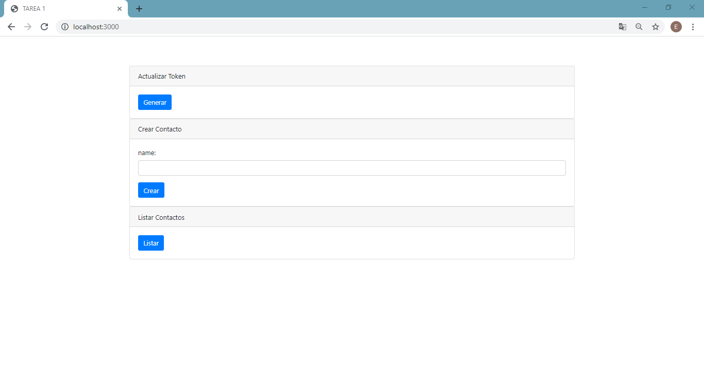
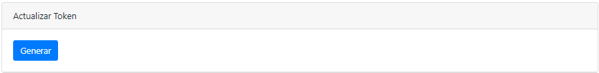
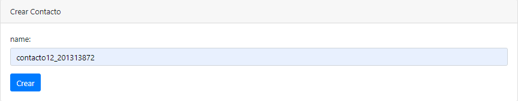
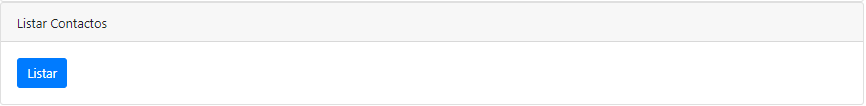
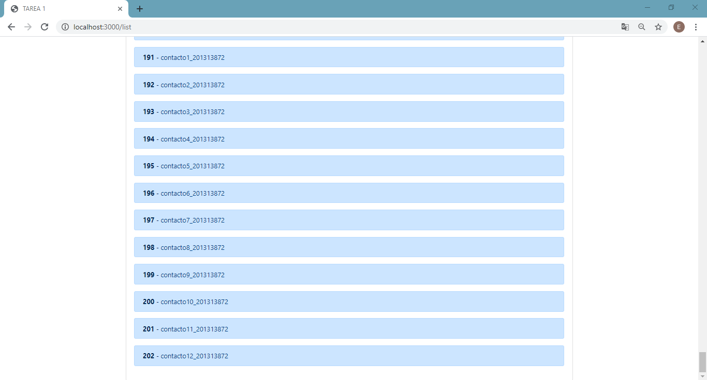

# TAREA 1
### Esteban David Alvarez Bor
### 201313872




## ACCESS TOKEN



Para poder generar un token de acceso se debe conocer el **clint_id** y **client_secret**
ademas de utilizar **client_credentials** para el _grant_type_ de autenticacion para OAuth2.  

```
     body = {  
        grant_type: cnts.GRANT_TYPE_,   
        client_id: cnts.CLIENT_ID_,   
        client_secret: cnts.CLIENT_SECRET_    
    }  
```

El **body** es utilizado para la ruta https://api.softwareavanzado.world/index.php?option=token&api=oauth2 para poder 
obtener asi el **access_token** requerido para poder utilizar los servicios disponibles.

## CREATE CONTACT



Para la creacion de un contacto nuevos utilizaremos el formulario propuesto en la vista raiz _/_ en la cual debemos ingresar el nombre del contacto a crear.

##### imagen form aqui

Al obtener el nombre **name** del nuevo contacto, agregaremos la categoria **0** por defecto para proceder a realizar la peticion de creacion.

```
app.post('/create', (req, res) => {
    let form_body = req.body;

    let body = {
        name: form_body.name,
        catid: 0
    }

    create.createContact(body);
```

Esta peticion es realizada a la ruta https://api.softwareavanzado.world/index.php?webserviceClient=administrator&webserviceVersion=1.0.0&option=contact&api=hal la cual recibe como parametros obligatorios:
1. name
2. catid

La funcion de creacion recibe el **body** mencionado anteriormente, ademas se debe agregar en el header de la peticion 
el **access_token** obtenido previamente anteponiendole el tipo de token **Bearer** para que la peticion pueda realizarse de manera exitosa y asi crear el nuevo contacto.

```
async function createContact(body) {
    let resp = null;

    resp = axios.post(cnts.CREATE_PATH, body, {
        headers: {
            'Content-Type': 'application/json',
            'Authorization': `Bearer ${cnts.TOKEN_}`
        }
    });

    return resp;

}
```

## LIST CONTACTS



Para poder listar los contactos disponibles en el sistema es necesario haber obtenido el **token** **de** **acceso**
previamente, esto para tener autorizacion en el sistema.  

Para obtener todos los contactos creados en el sistema utilizaremos la ruta https://api.softwareavanzado.world/index.php?webserviceClient=administrator&webserviceVersion=1.0.0&option=contact&api=hal&list[limit]=0, en esta podemos observar en su ultimo parametro 
`
list[limit]=0
`
estaremos obteniendo todos los contactos existentes.  

Ademas debemos agregar el **token** **de** **acceso** previamente obtenido a la peticion para que esta se pueda realizar exitosamente.

```
async function listContact() {

    return axios({
        method: 'get',
        url: cnts.LIST_PATH,
        headers: {
            'Content-Type': 'application/json',
            'Authorization': `Bearer ${cnts.TOKEN_}`
        }
    });
}
```




